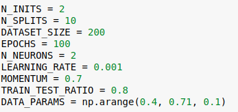
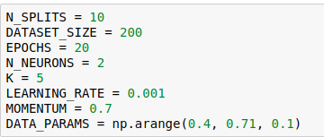

# MLG_PW2-NeuralNetworks-SupervisedLearning
Practical work 02 - Introduction to Neural Networks and Supervised Learning
## Authors
 * Fabien Franchini
 * Emmanuel Schmid

# 1. Explore the “hold_out_validation” notebook 

## Q1. Determine where do we define all the above mentioned parameters.
Observe that we run the evaluation procedure on four different problems. Each problem is
a two-class two-dimensional problem, where the two sets are more and more overlapped
(e.g., the synthetic datasets are randomly generated using variances of 0.4, 0.5, 0.6 and
0.7).

## Q2. What are the cyan and red curves in those plots ? Why are they different ?
mean squared error trough iterations

red curves = testing's error
cyan curves = Training's error

## Q3. What happens with the training and test errors (MSE) when we have the two sets more overlapped ?
Les valeurs du MSE sont d'une manière général plus haute et les variations sont plus grandes.
Normalement le MSE du training doit est inférieur à celui du testing, ici ce n'est pas le cas.

## Q4. Why sometimes the red curves indicate a higher error than the cyan ones ?
La phase d'apprentissage et d'entrainement ne s'effectue pas sur la même partie du dataset.
Généralement, si les valeurs ne sont pas assez différentes et donc s'overlap, le risque d'erreur est augmenté

## Q5. What is showing the boxplot summarizing the validation errors of the preceding experiments ? 
La répartition des MSE pour chaque répartitin du dataset. On remarque que pour répartition plus overlapped, la répartition des erreurs est plus grande (longueure des moustaches).

# 2. Explore the “cross_validation” notebook 
## Q1. Determine where do we define all the above mentioned parameters.

## Q2. What is the difference between hold-out and cross-validation ? What is the new parameter that has to be defined for cross-validation ?
hold-out: partage aléatoirement en deux le dataset. La règle général est d'utiliser 25% pour les tests et 75% pour l'entrainement. A chaque experimentation, le sous-échantillon de test est retiré au hasard. Les mêmes données peuvent être réutilisé plusieurs fois.
k-fold cross-validation : créé k sous-échantillon aléatoire, utilise 1 sous-échantillon pour tester et k-1 pour s'entrainer. L'itération suviante, un sous-échantillon différent sera utilisé pour les tests. Chaque échantillon est utilisé une seule fois.

## Q3. Observe the boxplots summarizing the validation errors obtained using the crossvalidation method and compare them with those obtained by hold-out validation.
- On remarque que les MSE ont tendance à être centrés. La disparations est faible.
- Cross validation a des MSE plus faible pour un "spread" plus elevé
- Les MSE sont cohérant entre les deux méthodes

# 3. Speaker recognition experiments 
## 1. Man vs Woman
Use only the natural voices of men and women to train a neural network that recognizes the gender of the speaker.

number of Observation :
- homme
- femme

Features being used to train the model :
procedure
 
## 2. Man vs. children
Proceed as explained in 0 but using only man and children voices.
## 3. Woman vs. children
Proceed as explained in 0 but using only woman and children voices.
## 4. Man vs. Woman vs. children
 Proceed as explained in 0.
## 5. Natural vs. synthetic voices
Proceed as explained in 0.
## 6. Design a final experiment of your choice (e.g., using your own voice)
Proceed asexplained in 0. 
